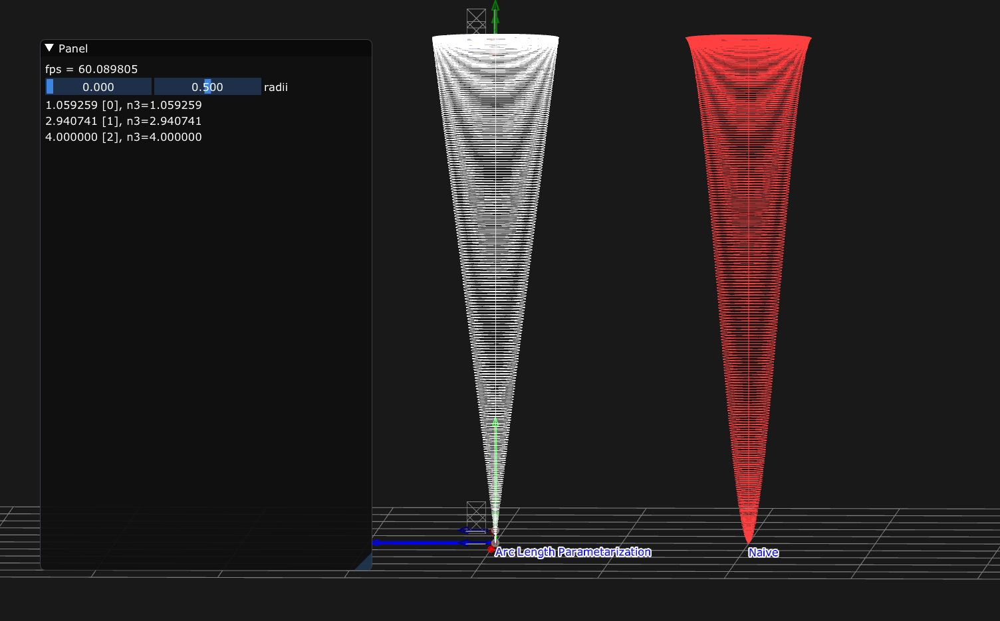
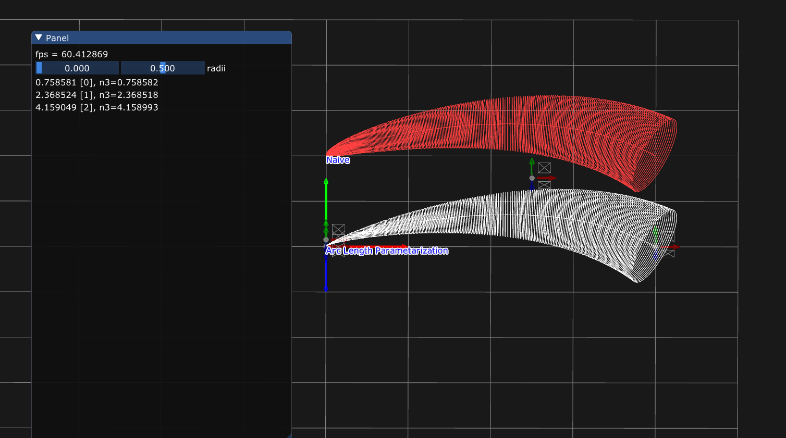

## Bezier Radius Correction 
Linear Radius Interpolation by using "Approximate Arc Length Parametrization"

## How to run

```
git submodule update --init
premake5 vs2019
```

## Images



## references 

MARCELO WALTER AND ALAIN FOURNIER "Approximate Arc Length Parametrization"

https://pomax.github.io/bezierinfo/legendre-gauss.html